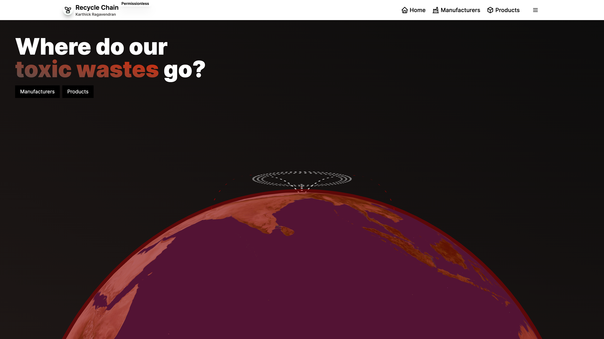
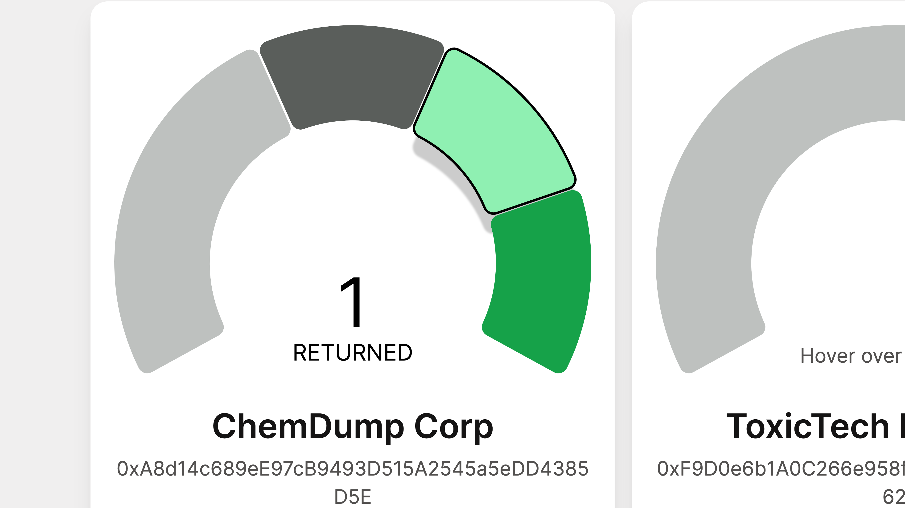
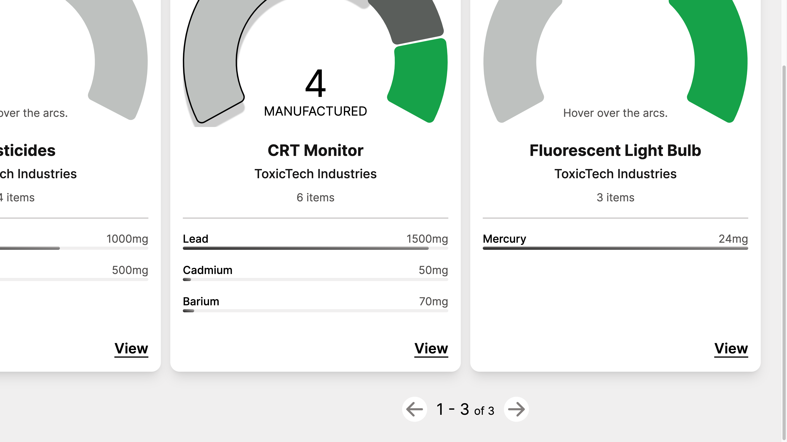

# RecycleChain Workshop

This repository houses the RecycleChain Workshop project, a monorepo that integrates multiple applications, libraries, and Solidity smart contracts. Follow this guide to set up the project locally and run the applications.

## Monorepo Contents

- Simple Counter Smart Contract (Solidity): A basic smart contract to demonstrate counter functionality.
- Recycle Chain Smart Contract (Solidity): The core smart contract for the RecycleChain application.
- React Native Application: A mobile app built with React Native.
- Next.js Frontend: A web application frontend developed with Next.js.
- NestJS Backend: A comprehensive backend featuring:
  - GraphQL API
  - REST API with Swagger documentation
  - Smart Contract Event Listeners
- Libraries: Supporting libraries for various functionalities:
  - Forms
  - Network
  - UI components
  - 3D graphics

## Screenshots





## Prerequisites

Before you begin, ensure you have the following installed on your system:

- Node.js (>= 14.x)
- Yarn (>= 1.22.x)
- Docker
- Git

## Getting Started

### 1. Clone the Repository

Clone the repository to your local machine using Git.

```bash
git clone https://github.com/karthickthankyou/recycle-chain-workshop
cd recycle-chain-workshop
```

### 2. Install Dependencies

Install the project dependencies using Yarn.

```
yarn install
```

### 3. Set Up Environment Variables

Create a .env file in the root directory and add the necessary environment variables. Refer to .env.example for the required variables.

### 4. Run the Database with Docker Compose

Start the PostgreSQL database using Docker Compose.

```
docker-compose up -d
```

### 5. Run Prisma Migrations

After the database is running, apply Prisma migrations to set up the database schema.

```
yarn prisma migrate dev
```

### 6. Run the Applications

You can run the individual applications using the following commands:

#### API Application

Navigate to the apps/api directory and start the API server and event listeners.

```
cd apps/api
yarn dev
```

#### WEB Application

Navigate to the apps/web directory and start the WEB server.

```
cd apps/web
yarn dev
```

#### React native Application

Navigate to the apps/web directory and start the WEB server.

```
cd standalone/mobile-apps
npm install

npm run android
npm run ios
npm run web

```

License
This project is licensed under the MIT License.
